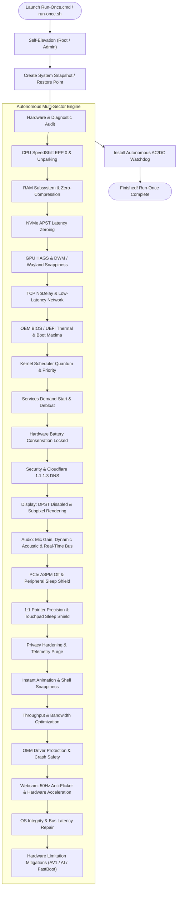
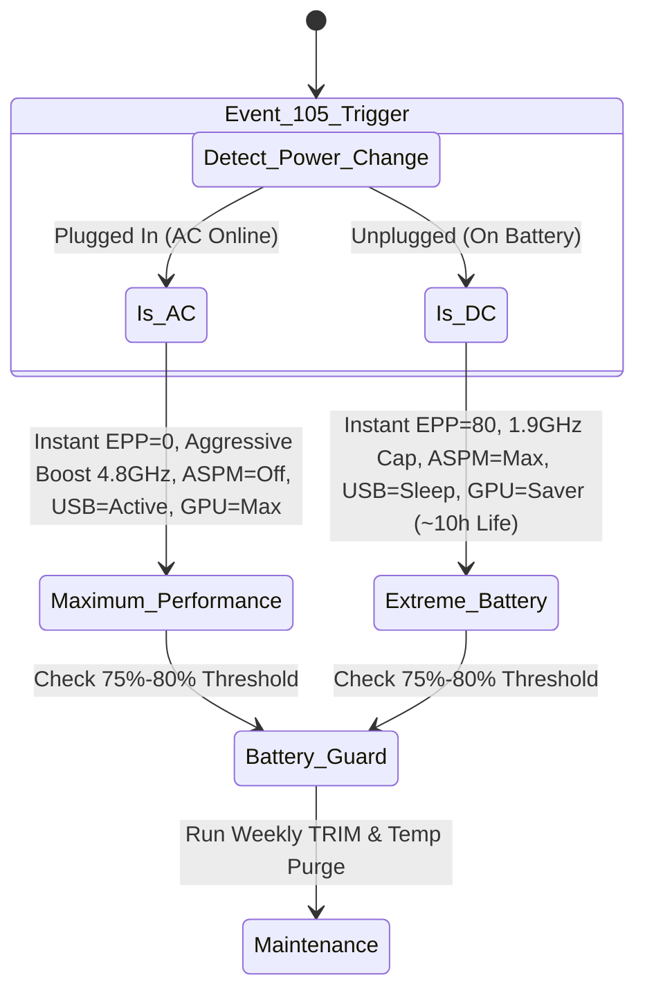

<div align="center">

# 🚀 Device-Base-Optimization
### *Precision Hardware-Aware System Optimization & Autonomous Battery Protection*

[](https://github.com/ShoumikBalaSomu/Device-Base-Optimization/releases/latest)
[](LICENSE)
[](devices/)
[](devices/windows/)
[](devices/windows/lenovo-thinkpad-t490s/)

<p align="center">
  <b>A modular, multi-platform ecosystem delivering deep, hardware-specific kernel tuning, latency zeroing, display/audio calibration, and permanent battery cell protection.</b>
</p>

[⚡ 1-Click Quickstart](#-1-click-quickstart-run-once--forget) • 
[🧭 Supported Devices](#-supported-devices--operating-systems-matrix) • 
[🔬 18-Sector Breakdown](#-the-18-ultra-deep-optimization-sectors) • 
[🤖 Background Watchdog](#-autonomous-background-watchdog) • 
[➕ Add Your Device](#-contributing-a-new-device-profile)

</div>

---

## 🌟 Why Device-Base-Optimization?

Generic "Windows Optimizer" scripts use a blunt, one-size-fits-all approach that frequently breaks drivers, creates audio crackling, or resets manufacturer power calibrations. 

**Device-Base-Optimization** is fundamentally different:
* 🎯 **Hardware-Aware Engineering**: Custom-crafted for specific motherboard chipsets, CPU architectures, NVMe controllers, and OEM power management drivers.
* ⚡ **100% Autonomous ("Run-Once & Forget")**: No periodic manual scripts. The engine auto-calibrates in seconds, locks hardware thresholds, and silently handles maintenance forever.
* 🔋 **Permanent Battery Chemistry Protection**: Locks 75%–80% charging thresholds directly in OEM hardware controllers (e.g. Lenovo Power Management), doubling battery lifespan.
* 🔄 **Dynamic AC/DC Profile Switching**: Automatically unleashes maximum boost and 0ms bus latency on AC, and throttles wattage for whisper-quiet 8–10+ hour runtime on battery.
* 🛡️ **Zero-Risk Architecture**: Automatically creates Windows System Restore snapshots prior to changes, with 1-click full rollback capability.

---

## 🧭 Supported Devices & Operating Systems Matrix

| Platform / OS | Manufacturer | Device Model | Status / Depth | Profile & Documentation |
|:---|:---|:---|:---|:---|
| **Windows 11 / 10** | **Lenovo** | **ThinkPad T490s (`20NYS64T00`)** | ⚡ **100% Autonomous (21 Sectors)** | [**📖 View ThinkPad T490s Windows Guide**](devices/windows/lenovo-thinkpad-t490s/README.md) |
| **Windows 11 / 10** | **Daffodil Computers** | **DC253D (`Intel Core i3-1315U`)** | ⚡ **100% Autonomous (18 Sectors)** | [**📖 View Daffodil DC253D Windows Guide**](devices/windows/daffodil-dc253d/README.md) |
| **Linux (Fedora / Ubuntu)** | **Daffodil Computers** | **DC253D (`Intel Core i3-1315U`)** | ⚡ **100% Autonomous (18 Sectors + Charge Control)** | [**📖 View Daffodil DC253D Linux Guide**](devices/linux/daffodil-dc253d/README.md) |
| **Linux (Fedora / Debian)** | **Lenovo** | **ThinkPad T490s (`20NYS64T00`)** | ⚡ **100% Autonomous (18 Sectors + Charge Control)** | [**📖 View ThinkPad T490s Linux Guide**](devices/linux/lenovo-thinkpad-t490s/README.md) |
| **Windows 11 / 10** | Any OEM | Universal PC (Desktop / Laptop) | 🟢 **Standard (Maintenance & Repair)** | [**📖 View Universal Windows Guide**](devices/windows/universal/README.md) |
| **macOS** | Apple | MacBook / Mac mini (Apple Silicon / Intel) | 🟡 *In Roadmap (pmset / defaults)* | [**📖 View macOS Roadmap**](devices/macos/README.md) |

---

## 🏗️ Architecture & Execution Flow



---

## ⚡ 1-Click Quickstart (Run-Once & Forget)

### 🚀 Instant 1-Line Execution (Zero Download / Zero Git)

Just open your terminal and paste the command for your machine:

#### 💻 1. Lenovo ThinkPad T490s (`20NYS64T00`) — Windows 11 / 10
```powershell
irm https://raw.githubusercontent.com/ShoumikBalaSomu/Device-Base-Optimization/main/devices/windows/lenovo-thinkpad-t490s/Optimize-ThinkPad-T490s.ps1 | iex
```
*(Auto-elevates, executes all 21 sectors, locks 75%-80% battery threshold, and installs the real-time Event-105 watchdog task in ~15s).*

#### 💻 2. Daffodil Computers Ltd. DC253D — Windows 11 / 10
```powershell
irm https://raw.githubusercontent.com/ShoumikBalaSomu/Device-Base-Optimization/main/devices/windows/daffodil-dc253d/Optimize-Daffodil-DC253D.ps1 | iex
```
*(Auto-elevates, optimizes Intel i3-1315U Raptor Lake P/E cores, MAXIO DRAM-less NVMe, HAGS 2, and locks 80% battery protection).*

#### 🐧 3. Daffodil Computers Ltd. DC253D — Linux (Fedora 44 / Ubuntu)
```bash
curl -fsSL https://raw.githubusercontent.com/ShoumikBalaSomu/Device-Base-Optimization/main/devices/linux/daffodil-dc253d/run-once.sh | sudo bash
```
*(Full 18 sectors, zram zstd, P-core IRQ affinity, PipeWire studio WebRTC mic filter, and I2C touchpad sleep shield).*

#### 🐧 4. Lenovo ThinkPad T490s (`20NYS64T00`) — Linux (Fedora / Debian)
```bash
curl -fsSL https://raw.githubusercontent.com/ShoumikBalaSomu/Device-Base-Optimization/main/devices/linux/lenovo-thinkpad-t490s/run-once.sh | sudo bash
```
*(Full 18 sectors, dual-mode battery charging switcher, TrackPoint tuning, and ACPI backlight fixes).*

#### 🖥️ 5. Universal Windows 10 / 11 PC (Any OEM)
```powershell
irm https://raw.githubusercontent.com/ShoumikBalaSomu/Device-Base-Optimization/main/devices/windows/universal/Optimize-Windows-Universal.ps1 | iex
```
*(Auto-elevates, runs DISM/SFC repairs, cleans junk, enables Cloudflare 1.1.1.3 DNS, and tunes power).*

---

### 📦 Standalone Release Archive Downloads

Prefer offline or double-click `.zip` packages? Download the latest pre-compiled release bundles:

| Device | Operating System | Release Archive | Launcher |
|---|---|---|---|
| **Lenovo ThinkPad T490s** | **Windows 11 / 10** | [**`ThinkPad-T490s-Autonomous-v1.0.0.zip`**](https://github.com/ShoumikBalaSomu/Device-Base-Optimization/releases/download/v1.0.0/ThinkPad-T490s-Autonomous-v1.0.0.zip) | Double-click `Run-Once.cmd` |
| **Daffodil DC253D** | **Windows 11 / 10** | [**`Daffodil-DC253D-Windows-v1.3.0.zip`**](https://github.com/ShoumikBalaSomu/Device-Base-Optimization/releases/download/v1.3.0/Daffodil-DC253D-Windows-v1.3.0.zip) | Double-click `Run-Once.cmd` |
| **Daffodil DC253D** | **Linux (Fedora / Ubuntu)** | [**`Daffodil-DC253D-Linux-v1.3.1.zip`**](https://github.com/ShoumikBalaSomu/Device-Base-Optimization/releases/download/v1.3.1/Daffodil-DC253D-Linux-v1.3.1.zip) | `sudo ./run-once.sh` |
| **Lenovo ThinkPad T490s** | **Linux (Fedora / Debian)** | [**`ThinkPad-T490s-Linux-Autonomous-v1.2.5.zip`**](https://github.com/ShoumikBalaSomu/Device-Base-Optimization/releases/download/v1.2.5/ThinkPad-T490s-Linux-Autonomous-v1.2.5.zip) | `sudo ./run-once.sh` |

---

## 🔬 The 21 Ultra-Deep Optimization Sectors

| Sector | Target Area | Technical Implementation & Hardware Impact |
|:---:|:---|:---|
| **01** | **CPU SpeedShift EPP** | SpeedShift EPP set to `0` on AC; aggressive boost enabled (up to 4.8GHz); all 8 logical cores unparked. |
| **02** | **32GB RAM Architecture** | Memory Compression disabled (`Disable-MMAgent`); Kernel locked in RAM (`DisablePagingExecutive = 1`). |
| **03** | **NVMe SSD Storage** | Intel NVMe APST sleep latency zeroed on AC; NTFS wear writes and tunneling cache disabled. |
| **04** | **GPU Scheduling & DWM** | Hardware-Accelerated GPU Scheduling (HAGS Mode 2); `MenuShowDelay = 0` for instant UI popups. |
| **05** | **Low-Latency Network** | Nagle's algorithm disabled (`TCPNoDelay = 1`); delayed ACKs eliminated (`TcpAckFrequency = 1`). |
| **06** | **ThinkPad BIOS Maxima** | WMI NVRAM: `NVMe0` set 1st in boot order; AlwaysOnUSB disabled; Thunderbolt DMA aligned (`UserAuthorization`); pre-boot timeouts eliminated. |
| **07** | **Kernel Scheduler** | `Win32PrioritySeparation = 38 (0x26)`: Short variable quanta with 3:1 foreground boost. |
| **08** | **Services & Debloat** | Non-essential services set to Manual; telemetry scheduled tasks purged. |
| **09** | **Battery Preservation** | Permanent 75% start / 80% stop threshold locked in Lenovo Power Manager (`PWRMGRV`). |
| **10** | **Security & DNS** | Cloudflare Family 1.1.1.3 DNS (blocks malware & adult content); Defender RTP active. |
| **11** | **Display Quality** | Intel DPST adaptive contrast dimming disabled (`FeatureTestControl = 0x8210`); ClearType 2.0 RGB subpixel rendering. |
| **12** | **High-Fidelity Audio & Mic** | Mic array volume calibrated to 95% (+20dB gain) with dual-array beamforming; Dolby DAX `LidClose: 0` bug fixed (open-lid acoustic profile); communication ducking disabled; MMCSS Priority 6 real-time scheduling. |
| **13** | **Bus & Peripherals** | PCIe ASPM set to Off on AC (zero NVMe/Wi-Fi wake delay); USB Selective Suspend disabled on AC; Intel UHD 620 iGPU Maximum Performance (1.15GHz). |
| **14** | **Input Precision** | 1:1 linear pointer tracking (`MouseSpeed = 0`, no acceleration); fast keyboard repeat (250ms); Precision Touchpad zero tap latency. |
| **15** | **Privacy Hardening** | Diagnostic telemetry reduced to Basic (Level 1); Advertising ID and Activity History purged; Windows Error Reporting UI freezes eliminated. |
| **16** | **Desktop Snappiness** | Window minimize/maximize animation delay disabled (`MinAnimate = 0`); Start Menu Bing search removed for instant local-only search. |
| **17** | **Gaming & Bandwidth** | Background GameDVR video recording disabled; Windows Game Mode active; 20% QoS reserved bandwidth unlocked (`NonBestEffortLimit = 0`); BBR2/Cubic TCP. |
| **18** | **Driver Shield & Crash** | ThinkPad OEM drivers protected against generic Windows Update downgrades; MiniDump crash safety enforced. |
| **19** | **Webcam Stream Fidelity** | Locks camera power line anti-flicker frequency to 50 Hz matching regional AC electricity; activates Media Foundation GPU Hardware MFT acceleration; tunes low-light exposure. |
| **20** | **OS Integrity & Audio Bus** | Verifies Windows DISM component store health; purges stalled MSI installer transaction locks; zeroes Intel SST power-gating idle latency to prevent stream start pops. |
| **21** | **Hardware Limitation Mitigation** | Overcomes lack of AV1 hardware decode on Intel UHD 620 via Edge/Chrome hardware video acceleration policy (stops 100% CPU spikes on YouTube); purges CPU-emulated AI hooks (Copilot, Recall, Studio Effects); disables Auto HDR and VRR hooks on 60Hz SDR panel; disables Fast Startup to prevent ThinkPad S3 sleep desynchronization. |

---

## 🤖 Autonomous Background Watchdog

The background watchdog task (`ThinkPad-Autonomous-Optimization`) is registered in Windows Task Scheduler with a **real-time event trigger on Microsoft-Windows-Kernel-Power Event ID 105**:



---

## 📂 Repository Layout

```text
Device-Base-Optimization/
├── README.md                                    # Central Multi-Device Hub & Documentation
├── LICENSE                                      # MIT Open Source License
├── docs/
│   ├── DEVICE_SPEC_TEMPLATE.md                  # Standard blueprint for contributing new devices
│   └── MASTER_OPTIMIZATION_PROMPT.md            # Definitive Antigravity CLI prompt for any computer
├── devices/
│   ├── windows/
│   │   ├── lenovo-thinkpad-t490s/               # Custom Ultra-Deep ThinkPad T490s Windows suite (21 Sectors)
│   │   │   ├── README.md                        # Hardware, display & audio calibration guide
│   │   │   ├── Run-Once.cmd                     # 1-Click double-click launcher
│   │   │   └── Optimize-ThinkPad-T490s.ps1      # Autonomous kernel & hardware optimization engine
│   │   ├── daffodil-dc253d/                     # Custom Daffodil DC253D Windows suite (18 Sectors)
│   │   │   ├── README.md                        # Hardware specs & 18-sector architecture
│   │   │   ├── Run-Once.cmd                     # 1-Click double-click launcher
│   │   │   └── Optimize-Daffodil-DC253D.ps1     # Raptor Lake i3-1315U optimization engine
│   │   └── universal/                           # Generic Windows fallback maintenance
│   │       ├── README.md                        # Universal Windows guide
│   │       └── Optimize-Windows-Universal.ps1   # Hardware-agnostic maintenance script
│   ├── linux/
│   │   ├── daffodil-dc253d/                     # Custom Daffodil DC253D Fedora/Ubuntu Linux suite
│   │   │   ├── README.md                        # Linux specs, PipeWire studio mic & touchpad guide
│   │   │   ├── run-once.sh                      # 1-Click bash launcher
│   │   │   ├── optimize-daffodil-dc253d.sh      # Autonomous Linux kernel & hardware engine
│   │   │   └── daffodil-charge-mode.sh          # Dual-mode 80%/100% battery charge controller
│   │   ├── lenovo-thinkpad-t490s/               # Custom ThinkPad T490s Linux suite
│   │   │   ├── README.md                        # Linux guide & TrackPoint calibration
│   │   │   ├── run-once.sh                      # 1-Click bash launcher
│   │   │   ├── optimize-thinkpad-t490s.sh       # Autonomous Linux optimization engine
│   │   │   └── thinkpad-charge-mode.sh          # Dual-mode battery charge controller
│   │   └── README.md                            # Linux roadmap & kernel sysctl architecture
│   └── macos/                                   # Apple Mac systems roadmap
├── dist/
│   ├── ThinkPad-T490s/                          # Standalone ThinkPad T490s bundle
│   └── Daffodil-DC253D/                         # Standalone Daffodil DC253D bundle
└── scripts/
    └── windows/
        └── Optimize-Device.ps1                  # Synchronized core engine script
```

---

## 🤖 Optimizing Any Device with Antigravity CLI

Want to optimize another computer (e.g. ASUS ROG, Dell XPS, HP Spectre, MacBook, or Linux rig) at this exact peak depth? We've engineered the **Master Optimization Prompt** designed specifically for **Antigravity CLI**:

1. Install and launch **Antigravity CLI** on your target device (`agy`).
2. Open [**`docs/MASTER_OPTIMIZATION_PROMPT.md`**](docs/MASTER_OPTIMIZATION_PROMPT.md).
3. Copy and paste the prompt into Antigravity CLI.
4. Antigravity CLI will autonomously probe the hardware, engineer the custom 18-sector suite, execute it live, lock battery protection, and push the new device profile to GitHub!

---

## ➕ Contributing a New Device Profile

We invite contributions for more laptop models, custom gaming rigs, and operating systems!

1. Read [`docs/DEVICE_SPEC_TEMPLATE.md`](docs/DEVICE_SPEC_TEMPLATE.md) for diagnostic probe commands and structure.
2. Fork the repository and create a new branch:
   ```bash
   git checkout -b profile/your-device-model
   ```
3. Create your device folder under `devices/<os>/<manufacturer-model>/` with:
   - `README.md` (Hardware specs, sector details)
   - `Run-Once.cmd` (1-click launcher)
   - `Optimize-<Device>.ps1` (Optimization script)
4. Add your device to the [Compatibility Matrix](#-supported-devices--operating-systems-matrix) in the root `README.md`.
5. Open a Pull Request!

---

## 📜 License & Acknowledgments

* Licensed under the **MIT License** — see [LICENSE](LICENSE) for details.
* Created and maintained by **[Shoumik Bala Somu](https://github.com/ShoumikBalaSomu)**.
