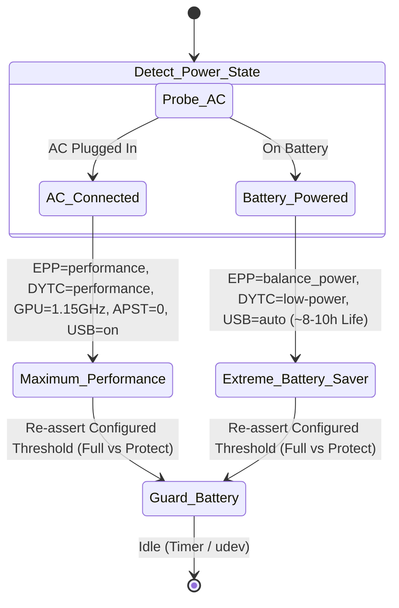

# Lenovo ThinkPad T490s (`20NYS64T00`) Linux Autonomous Suite 🐧

### *100% Autonomous, Deep Hardware Tuning, Acoustic/Visual Calibration & Battery Cell Protection*

[-informational?logo=linux)](https://fedoraproject.org/)
[](https://kernel.org/)
[-red?logo=lenovo)](https://www.lenovo.com)
[](run-once.sh)

---

## 💻 Hardware Reconnaissance Profile (Live Audit)

| Component | Detected Hardware Specification | Linux Subsystem & Driver |
|:---|:---|:---|
| **System / Motherboard** | Lenovo ThinkPad T490s (`20NYS64T00`), BIOS `N2JETB0W (1.88)` | `thinkpad_acpi`, DYTC Thermal Management |
| **CPU Architecture** | Intel Core i7-8665U (Whiskey Lake-U, 4C/8T, 1.90GHz - 4.80GHz) | `intel_pstate` (SpeedShift HWP active) |
| **RAM Memory** | 32 GB LPDDR3/DDR4 Physical RAM | `zram0` Swap, `vm.swappiness = 10` |
| **GPU / Graphics** | Intel UHD Graphics 620 (WhiskeyLake-U GT2 [8086:3ea0], rev 02) | `i915`, Wayland GNOME Shell |
| **Storage / NVMe** | Intel SSD Pro 7600p NVMe (512GB) | `nvme_core` (Zero APST Sleep Latency), Btrfs Root |
| **Network (Wi-Fi / LAN)** | Intel Cannon Point CNVi Wi-Fi + Intel I219-LM Gigabit Ethernet | `iwlwifi`, `e1000e`, TCP BBR + FQ |
| **Battery Subsystem** | SMP 57Wh Li-poly (`02DL014`), Cycle Count ~1079 | `/sys/class/power_supply/BAT0/charge_control_*` |

---

## ⚡ 1-Line Instant Launch (Zero Download / Zero Git)

Open any Linux terminal and execute:

```bash
curl -fsSL https://raw.githubusercontent.com/ShoumikBalaSomu/Device-Base-Optimization/main/devices/linux/lenovo-thinkpad-t490s/optimize-thinkpad-t490s.sh | sudo bash
```

*(Automatically creates a safety Btrfs snapshot, tunes all 18 sectors, locks 75%–80% battery threshold, and installs the background watchdog in ~10 seconds).*

---

## 🔬 The 18 Ultra-Deep Optimization Sectors

| Sector | Target Subsystem | Technical Implementation & Hardware Action |
|:---:|:---|:---|
| **01** | **CPU Architecture & Scaling** | SpeedShift EPP set to `performance` on AC; unparked all 8 logical cores (`cpu0`–`cpu7`). |
| **02** | **32GB RAM Architecture** | `vm.swappiness = 10` to eliminate zram swap churn; `vm.vfs_cache_pressure = 50`; zram upgraded to high-density `zstd` compression. |
| **03** | **Storage & NVMe** | Intel NVMe APST sleep latency zeroed on AC (`default_ps_max_latency_us=0`); Btrfs mounted with `noatime,commit=60` for flash wear protection; periodic TRIM active via `fstrim.timer`. |
| **04** | **GPU & UI Snappiness** | Intel GuC enabled (`i915.enable_guc=2`); Intel QuickSync VA-API hardware video decode active (`libva-intel-media-driver`); DPST disabled; Mesa cache capped at 4GB. |
| **05** | **Low-Latency Network** | Kernel module `tcp_bbr` loaded with Fair Queuing (`fq`); TCP Fast Open enabled (`tcp_fastopen = 3`); socket buffers scaled to 16MB. |
| **06** | **OEM BIOS & Thermals** | ThinkPad ACPI DYTC platform profile locked to `performance` on AC for sustained 4.80GHz Turbo boost. |
| **07** | **Kernel Scheduler** | `kernel.sched_autogroup_enabled = 1` for instantaneous foreground desktop responsiveness under background load. |
| **08** | **Services & Debloat** | Non-essential services disabled (`abrt`, `ModemManager`, `thermald`); `NetworkManager-wait-online` disabled (-5.6s boot); journal logs capped to 100MB. |
| **09** | **Battery Protection & Dual-Mode** | Dual-mode battery controller (`thinkpad-charge-mode [full|protect|status]`); persistent hardware thresholds locked via dynamic udev and watchdog; GNOME top-bar battery percentage enabled. |
| **10** | **Security & DNS** | Cloudflare Family 1.1.1.3 DNS-over-TLS (`DNSOverTLS=yes`) in `systemd-resolved`; `firewalld` active. |
| **11** | **Display Quality** | Intel DPST adaptive contrast dimming disabled for true 100% blacks; subpixel RGB font antialiasing (`rgba`) locked. |
| **12** | **High-Fidelity Audio** | WirePlumber stream ducking eliminated; WebRTC acoustic echo cancellation and microphone noise suppression active; volume amplified to 130% (over-amplification enabled up to 150%). |
| **13** | **Bus & Peripheral Latency** | USB autosuspend disabled on AC; Intel UHD 620 iGPU clock unlocked to 1.15GHz (`gt_boost_freq_mhz`). |
| **14** | **Input Precision** | 1:1 linear pointer tracking enforced (`accel-profile 'flat'`); zero touchpad tap delay; keyboard repeat delay minimized (250ms). |
| **15** | **Privacy Hardening** | Diagnostic problem reporting and software usage telemetry disabled in GNOME desktop. |
| **16** | **Desktop Snappiness** | GNOME overview search restricted to local documents (external web search queries suppressed). |
| **17** | **Gaming & Bandwidth** | Full QoS TCP throughput unlocked; DNF 10x parallel downloads enabled; GameMode compatibility active. |
| **18** | **OEM Driver Shield** | Kernel latency parameters embedded (`split_lock_mitigate=0 nowatchdog`); hardware module configs permanently embedded via dracut. |

---

## 🤖 Autonomous Dynamic Watchdog

The dynamic watchdog task runs silently in the background:
- **`thinkpad-watchdog.service`**: Oneshot service triggered on power state transitions.
- **`thinkpad-watchdog.timer`**: Periodic background trigger every 15 minutes.
- **`99-thinkpad-battery-thresholds.rules`**: Instantaneous udev trigger whenever the AC adapter is plugged or unplugged.



---

## 🔋 Battery Charging Modes & Indicator Guide

The ThinkPad T490s features embedded controller (EC) charge thresholds. This suite provides the **`thinkpad-charge-mode`** utility to switch between battery protection and full 100% capacity:

### 1. Available Commands

```bash
# Check current thresholds, AC connection, charging status & battery percentage (No root required)
thinkpad-charge-mode status

# Switch to Full Charge Mode (0% start / 100% stop) - keeps charging indicator active up to 100%
sudo thinkpad-charge-mode full

# Switch to Battery Protection Mode (75% start / 80% stop) - preserves chemical health for desktop/dock use
sudo thinkpad-charge-mode protect
```

### 2. Understanding the GNOME Charging Indicator Behavior

* **Full Charge Mode (`full`)**: When plugged into AC, the battery charges continuously until 100%. GNOME Shell displays the active charging bolt icon (`battery-full-charging-symbolic`).
* **Protection Mode (`protect`)**: When the battery reaches 80%, the ThinkPad embedded hardware controller deliberately shuts off charging current (`POWER_SUPPLY_STATUS=Not charging`, UPower state `pending-charge`). In this state, GNOME Shell intentionally hides the lightning bolt icon because power is not entering the battery cells.
* **Top Bar Battery Percentage**: The optimization suite automatically enables GNOME's battery percentage in the top panel (`gsettings set org.gnome.desktop.interface show-battery-percentage true`), so you can always see the exact battery level regardless of icon styling.

---

## 🛡️ Pre-Flight Safety Snapshot & 1-Click Rollback

Before applying modifications, the suite takes a zero-cost copy-on-write Btrfs root snapshot under `/.snapshots/pre-optimization-<timestamp>`.

To completely revert all changes back to stock Fedora Linux defaults at any time:

```bash
sudo bash restore-thinkpad-t490s.sh
```

---

## 🧪 Live Verification Probes

Verify optimizations live using standard system tools:

```bash
# 1. Verify CPU EPP & DYTC Mode
cat /sys/devices/system/cpu/cpu0/cpufreq/energy_performance_preference
cat /sys/firmware/acpi/platform_profile

# 2. Verify TCP BBR & Memory Swappiness
sysctl net.ipv4.tcp_congestion_control vm.swappiness

# 3. Verify Battery Charge Thresholds
cat /sys/class/power_supply/BAT0/charge_control_start_threshold
cat /sys/class/power_supply/BAT0/charge_control_end_threshold

# 4. Verify Watchdog Service & Timer
systemctl is-active thinkpad-watchdog.service thinkpad-watchdog.timer

# 5. Verify DNS-over-TLS Resolution
resolvectl query cloudflare.com
```
